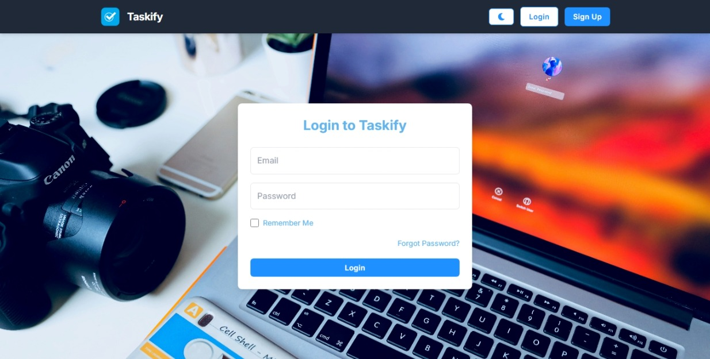

# Taskify - Task Management App



**Taskify** is a modern task management application with secure Firebase authentication. It features user signup/login, password reset, profile management, and a "Remember Me" option for seamless logins. Built with React, Tailwind CSS, and Firebase, Taskify offers a sky-themed, responsive UI with dark mode support.

## Features

- **Authentication**:
  - Signup with user name, email, password.
  - Login with "Remember Me" to save credentials.
  - Forgot Password sends reset link.
  - Custom Reset Password page.
- **Profile**:
  - Displays user name ("Welcome, [Name]").
  - Logout functionality.
- **UI/UX**:
  - Responsive: Mobile-friendly, desktop-optimized.
  - Dark mode support.
  - Smooth animations, toasts, and loading states.
- **Tech Stack**:
  - **Frontend**: React, Tailwind CSS, React Router, React Toastify.
  - **Backend**: Firebase Authentication.
  - **Hosting**: Firebase Hosting (optional GitHub Pages).

## Prerequisites

- **Node.js** (v16 or higher)
- **Git**
- **Firebase Account** (for authentication and hosting)
- **GitHub Account**

## Installation

1. **Clone the Repository**:
   ```bash
   git clone https://github.com/muzamal478/taskify.git
   cd taskify

2. **Install Dependencies:**:
   ```bash
    npm install

3. **Set Up Firebase:**:
- Create a Firebase project at console.firebase.google.com.
- Enable Email/Password Authentication.
- Copy Firebase config to src/firebase.js:

   ```bash
    import { initializeApp } from "firebase/app";
    import { getAuth } from "firebase/auth";
   
    const firebaseConfig = {
    apiKey: "YOUR_API_KEY",
    authDomain: "taskmanager-b714f.firebaseapp.com",
    projectId: "taskmanager-b714f",
    storageBucket: "taskmanager-b714f.appspot.com",
    messagingSenderId: "YOUR_MESSAGING_SENDER_ID",
    appId: "YOUR_APP_ID"
    };
   
    const app = initializeApp(firebaseConfig);
    export const auth = getAuth(app);

4. **Run Locally:**:
   ```bash
    npm start

- Opens at http://localhost:3000.

## Contact
- GitHub: [muzamal478](https://github.com/muzamal478)
- Email: [muzamallasghar47@gmail.com](muzamallasghar47@gmail.com)
